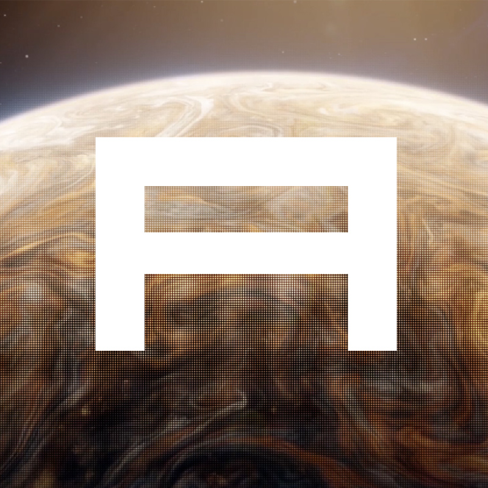

## Overview 🪐
Alpha Aquilae is the brightest star in the constellation of Aquila as well as the twelfth-brightest star in the night sky. As such, our token—Alpha Aquilae ($Altair)—seeks to bring light upon the darkness that, at times, infests the space. 

With our experienced and dedicated team—who are talented in a variety of areas— you will feel at ease with your investment and remain in a state of calm. Not only this, but our team is very well connected meaning that we will be set up for established partnerships in the future.  Earth is no longer in view and that is simply irrelevant. 

Our main goal is to have you—the investor—entrust us with expanding your investment. We want this to be a token surrounded by feelings of euphoria and excitement, avoiding any notion of fear and worry. To accomplish this, we will pride ourselves in bringing you continuous transparency and utility. 

By brining you constant utility, the star will continuously be lit and shine bright. At every point of the project there will good reason to own the tokens; they will never be rendered useless. As well, the low tax—6% on both buys and sells—makes it more affordable to trade, meaning there is greater access to entry. 

Included in the utility is the opportunity to receive even more tokens...
 
[UTILITY 1]()
 
[UTILITY 2]()
 
[UTILITY 3]()

